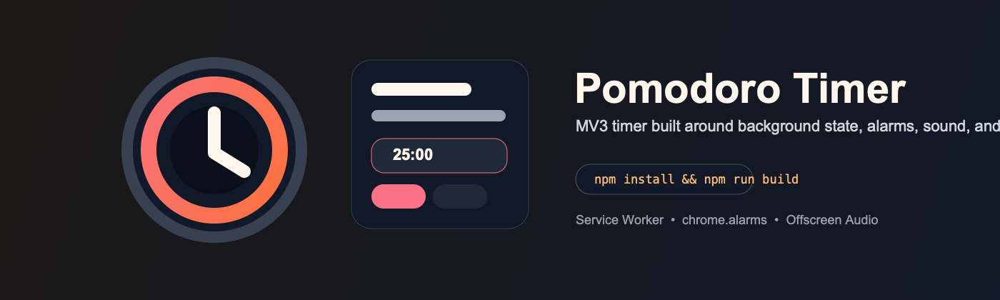

<p align="center">
  
</p>

<h1 align="center">Pomodoro Timer Extension</h1>

<p align="center">
  Chrome MV3 Pomodoro timer built to keep state alive after the popup closes.
</p>

<p align="center">
  <a href="#installation"></a>
  <a href="#installation"></a>
  <a href="#installation"></a>
</p>

<p align="center">
  <code>npm install && npm run build</code>
</p>

This extension keeps Pomodoro timing reliable by moving session state into the background service worker and coordinating alarms, notifications, sound, and badge updates around that runtime.

## At a Glance

- Background service worker owns timer state and session transitions
- Popup, Options, and Offscreen runtimes are separated by responsibility
- Notifications, sound preview, and badge countdown continue to work with MV3 constraints

## Why This Extension

- Popup-only timers are fragile in MV3 because popup lifecycle is short
- State persistence and recovery are first-class concerns here, not add-ons
- The project is structured to support real usage, not just a demo timer

## Core Features

- Focus / Break / Long Break sessions
- Start / Pause / Reset / Skip controls
- Auto-switch between sessions
- Notification and sound settings with preview
- Badge countdown toggle
- Text / ring popup display modes
- Compact mode and light/dark theme

## Installation

### Requirements

- Node.js 18+
- Chrome or Chromium-based browser with extension developer mode enabled

### Development

```bash
npm install
npm run dev
```

### Production Build

```bash
npm run build
```

Load `dist/` from `chrome://extensions` using **Load unpacked**.

## Usage

- Start a focus session from the popup
- Let the background service worker keep the session alive
- Edit durations, sound, badge, and display settings in Options
- Use preview actions before enabling notifications or sound

## Runtime Architecture

```txt
Popup UI  -> Background Service Worker -> storage / alarms / notifications / badge
Options UI -> Background Service Worker -> offscreen audio playback
```

## Project Structure

```txt
manifest.json
src/
  app/
    popup/
    options/
    offscreen/
  scripts/
    background/
    content/
  shared/
    utils/
```

## Contributing

Before opening a PR:

```bash
npm run lint
npm run build
```

Manual checks should include:

- popup close / reopen during a running session
- notification preview and sound preview
- badge updates during a running timer
- long break transition behavior

Issue reports should include:

- Chrome version and OS
- Exact settings used
- Reproduction steps
- Expected vs actual timer behavior

Recommended commit prefixes: `feat`, `fix`, `docs`, `refactor`, `test`, `chore`
