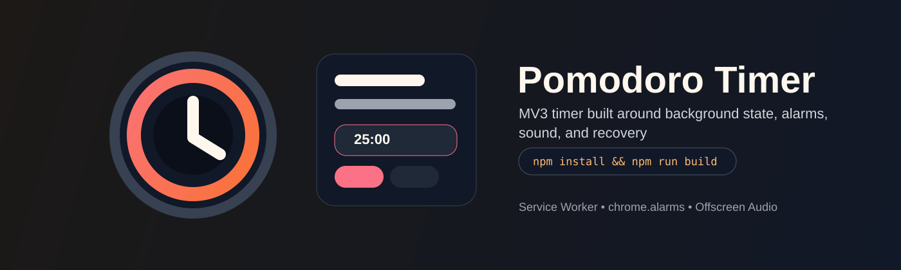

<p align="center">
  
</p>

<h1 align="center">Pomodoro Timer Extension</h1>

<p align="center">
  팝업이 닫혀도 상태가 유지되도록 설계한 Chrome MV3 포모도로 타이머 확장입니다.
</p>

<p align="center">
  <a href="#설치"></a>
  <a href="#설치"></a>
  <a href="#설치"></a>
</p>

<p align="center">
  <code>npm install && npm run build</code>
</p>

이 확장은 타이머 상태를 백그라운드 서비스 워커에 두고, 알람, 알림, 사운드, 배지 갱신을 그 런타임 기준으로 맞춰 MV3 환경에서도 안정적인 포모도로 경험을 제공하는 데 집중합니다.

## 한눈에 보기

- 백그라운드 서비스 워커가 타이머 상태와 세션 전환을 관리
- Popup, Options, Offscreen 런타임을 역할별로 분리
- MV3 제약 안에서도 알림, 사운드, 배지 카운트다운을 안정적으로 처리

## 왜 이 확장인가

- MV3에서는 팝업 기반 타이머가 쉽게 끊깁니다
- 이 프로젝트는 상태 복구와 지속성을 핵심 요구사항으로 다룹니다
- 단순 데모가 아니라 실제 사용 가능한 타이머 확장을 목표로 합니다

## 핵심 기능

- Focus / Break / Long Break 세션
- Start / Pause / Reset / Skip 제어
- 세션 자동 전환
- 알림 / 사운드 설정 및 미리보기
- 배지 카운트다운 토글
- 텍스트 / 링 표시 모드
- Compact mode 및 라이트 / 다크 테마

## 설치

### 요구사항

- Node.js 18+
- 개발자 모드가 가능한 Chrome 또는 Chromium 기반 브라우저

### 개발 모드

```bash
npm install
npm run dev
```

### 프로덕션 빌드

```bash
npm run build
```

`chrome://extensions`에서 **압축해제된 확장 프로그램 로드**로 `dist/`를 선택하면 됩니다.

## 사용법

- 팝업에서 포커스 세션을 시작합니다
- 세션 진행은 백그라운드 서비스 워커가 유지합니다
- Options에서 시간, 사운드, 배지, 표시 방식을 조정합니다
- 실제 사용 전에 알림과 사운드를 미리보기로 확인합니다

## 런타임 구조

```txt
Popup UI  -> Background Service Worker -> storage / alarms / notifications / badge
Options UI -> Background Service Worker -> offscreen audio playback
```

## 프로젝트 구조

```txt
manifest.json
src/
  app/
    popup/
    options/
    offscreen/
  scripts/
    background/
    content/
  shared/
    utils/
```

## 기여

PR 전에는 다음을 확인해 주세요.

```bash
npm run lint
npm run build
```

수동 확인 권장 항목:

- 실행 중 팝업 닫기 / 다시 열기
- 알림 및 사운드 미리보기
- 배지 카운트다운 갱신
- 긴 휴식 전환 동작

이슈에는 아래 정보를 포함해 주세요.

- Chrome 버전과 OS
- 사용한 설정값
- 재현 단계
- 기대 동작과 실제 동작

권장 커밋 프리픽스: `feat`, `fix`, `docs`, `refactor`, `test`, `chore`
